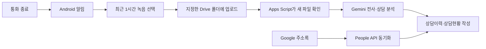

# 민원방패 Android

통화가 끝나면 알림을 보내고, 사용자가 선택한 최근 통화 녹음을 지정한 Google Drive 폴더에 업로드하는 Android 앱입니다. 함께 제공하는 Google Apps Script는 Drive에 올라온 녹음을 Gemini로 전사·분석하여 Google Sheets에 상담 기록을 만듭니다.

> 이 앱은 통화를 직접 녹음하지 않습니다. 휴대전화가 이미 저장한 통화 녹음 파일을 사용자가 확인하고 선택했을 때만 Drive에 업로드합니다.

## 전체 흐름



Android 앱과 Apps Script의 역할은 분리되어 있습니다.

| 구성 | 역할 |
|---|---|
| Kotlin Android 앱 | 통화 종료 감지, 알림, 최근 녹음 조회, Drive 업로드 |
| 시리즈 1 Apps Script | 녹음 전사·상담 분석·상담 횟수 집계 |
| 시리즈 2 Apps Script | 시리즈 1 전체 기능 + Google 주소록 연동·초기화 |

## 저장소 구성

```text
.
├─ app/                         Android 앱 소스
├─ apps-script/
│  ├─ 2026-09-27-민원방패-시리즈1-v4-복수처리.gs
│  └─ 2026-09-29-민원방패-시리즈2-v2-이름매칭.gs
├─ gradle/                      Gradle Wrapper
├─ build.gradle.kts
├─ settings.gradle.kts
└─ README.md
```

## 먼저 알아둘 점

### 어떤 GS 파일을 사용해야 하나요?

- 녹음 분석과 상담 기록만 필요하면 **시리즈 1**을 사용합니다.
- Google 주소록까지 연결하려면 **시리즈 2**를 사용합니다.
- 시리즈 2는 시리즈 1 기능을 모두 포함한 완성 코드입니다.

두 GS 파일을 같은 Apps Script 프로젝트에 동시에 붙여 넣으면 함수와 상수가 중복되어 오류가 발생합니다. 새로 시작한다면 필요한 파일 하나만 `Code.gs`에 붙여 넣으세요. 시리즈 1을 사용하다 시리즈 2로 넘어간다면 기존 `Code.gs` 전체를 시리즈 2 코드로 교체합니다.

## 1. 준비물

- Android 12(API 31) 이상의 실제 안드로이드 휴대전화
- Windows PC와 Android Studio
- Google 계정
- Google Drive와 Google Sheets
- Google Cloud 프로젝트
- Google AI Studio에서 만든 Gemini API 키
- 휴대전화의 통화 녹음 기능

이 프로젝트의 주요 빌드 설정은 다음과 같습니다.

| 항목 | 값 |
|---|---|
| 패키지 이름 | `kr.hs.minwonshield` |
| 최소 Android 버전 | Android 12, API 31 |
| Compile/Target SDK | API 35 |
| Java/JVM | 17 |
| Google Play services auth | `22.0.0` |

## 2. Google Cloud 설정

Android 앱이 사용자가 고른 Drive 폴더에 파일을 올리려면 Google Cloud 설정이 필요합니다.

### 2-1. API 사용 설정

1. [Google Cloud Console](https://console.cloud.google.com/)에서 프로젝트를 만들거나 선택합니다.
2. **API 및 서비스 → 라이브러리**로 이동합니다.
3. `Google Drive API`를 검색해 사용 설정합니다.
4. `Google Picker API`를 검색해 사용 설정합니다.

### 2-2. OAuth 동의 화면

1. **Google Auth Platform → 브랜딩**에서 앱 이름과 지원 이메일을 입력합니다.
2. 개인 시험이라면 대상을 `외부`로 설정할 수 있습니다.
3. 앱이 테스트 상태라면 **대상 → 테스트 사용자**에 실제 사용할 Google 계정을 등록합니다.
4. **데이터 액세스 → 범위 추가 또는 삭제**에서 다음 범위를 추가합니다.

```text
https://www.googleapis.com/auth/drive.file
```

이 프로젝트는 전체 Drive 접근 권한인 `drive`를 요청하지 않습니다. `drive.file`은 사용자가 앱에 허용한 파일과 폴더에 한정된 권한입니다.

### 2-3. Android OAuth 클라이언트

1. **Google Auth Platform → 클라이언트 → 클라이언트 만들기**를 선택합니다.
2. 애플리케이션 유형은 `Android`를 선택합니다.
3. 패키지 이름에 다음 값을 입력합니다.

```text
kr.hs.minwonshield
```

4. 아래 명령으로 자신의 디버그 SHA-1을 확인합니다.

```powershell
.\gradlew.bat signingReport
```

출력의 `Variant: debug` 아래에 있는 `SHA1` 값을 Google Cloud에 입력합니다. 다른 사람이 프로젝트를 빌드하면 디버그 인증서가 달라지므로 각자 자신의 SHA-1로 Android OAuth 클라이언트를 만들어야 합니다.

Play 스토어 또는 서명된 Release APK를 사용한다면 디버그 SHA-1 대신 Release 서명 인증서의 SHA-1을 별도로 등록해야 합니다.

> OAuth 클라이언트 ID나 클라이언트 보안 비밀번호를 Kotlin 코드에 붙여 넣을 필요는 없습니다. Google Play services가 패키지 이름과 SHA-1을 이용해 Android 앱을 확인합니다.

## 3. Android 앱 빌드와 설치

### 3-1. Android Studio에서 열기

1. [Android Studio](https://developer.android.com/studio)를 설치합니다.
2. `File → Open`에서 이 저장소의 루트 폴더를 선택합니다.
3. Gradle 동기화가 끝날 때까지 기다립니다.
4. SDK Manager에서 Android SDK Platform 35가 설치되어 있는지 확인합니다.
5. Android Studio에 포함된 JDK 17을 사용합니다.

명령줄에서 시험용 APK를 만들려면 저장소 루트에서 다음 명령을 실행합니다.

```powershell
.\gradlew.bat assembleDebug
```

빌드된 APK는 다음 위치에 생성됩니다.

```text
app/build/outputs/apk/debug/app-debug.apk
```

`app/build`와 APK는 다시 만들 수 있는 결과물이므로 GitHub에는 포함하지 않습니다.

### 3-2. 실제 휴대전화 연결

1. 휴대전화의 **설정 → 휴대전화 정보 → 소프트웨어 정보**에서 빌드 번호를 여러 번 눌러 개발자 옵션을 활성화합니다.
2. 개발자 옵션에서 **USB 디버깅**을 켭니다.
3. USB 케이블로 PC와 휴대전화를 연결합니다.
4. 휴대전화에 표시되는 디버깅 허용 창을 승인합니다.
5. Android Studio 상단 기기 목록에서 휴대전화를 선택하고 실행 버튼을 누릅니다.

Windows에서 기기가 보이지 않으면 제조사 USB 드라이버를 설치하거나 Android Studio의 **Tools → Troubleshoot Device Connections**를 실행합니다.

USB로 앱을 한 번 설치했다면 실제 사용을 위해 무선 디버깅을 설정할 필요는 없습니다. 무선 디버깅은 코드를 수정한 뒤 케이블 없이 다시 설치하고 싶을 때 선택적으로 사용합니다.

## 4. Android 앱 처음 사용하기

1. 앱을 실행합니다.
2. **통화·알림·오디오 권한 설정**을 누르고 요청된 권한을 허용합니다.
3. **Google Drive 폴더 연결**을 누릅니다.
4. Google 계정을 선택하고 `drive.file` 권한을 승인합니다.
5. 녹음 파일을 올릴 Drive 폴더를 선택합니다.
6. 실제 전화를 연결했다가 종료합니다.
7. `통화 녹음을 올릴까요?` 알림을 누릅니다.
8. 앱에 표시된 최근 통화 녹음 중 하나를 선택합니다.
9. 업로드 완료 메시지와 Drive 폴더의 파일을 확인합니다.

앱은 MediaStore에서 다음 조건에 맞는 파일만 조회합니다.

- 저장 경로: `Recordings/Call` 아래
- 조회 시점 기준 최근 1시간 이내에 저장된 오디오
- 최신 파일부터 표시

기기의 녹음 저장 경로가 다르면 `MainActivity.kt`의 `CALL_RECORDINGS_PATH` 값을 기기에 맞게 수정해야 합니다.

## 5. 시리즈 1 Apps Script 설정

파일: [`apps-script/2026-09-27-민원방패-시리즈1-v4-복수처리.gs`](apps-script/2026-09-27-민원방패-시리즈1-v4-복수처리.gs)

### 5-1. 설치

1. 새 Google 스프레드시트를 만듭니다.
2. **확장 프로그램 → Apps Script**를 엽니다.
3. 기본 `Code.gs` 내용을 모두 지웁니다.
4. 시리즈 1 GS 파일 전체를 복사해 붙여 넣고 저장합니다.
5. 스프레드시트를 새로고침합니다.
6. 상단에 생성된 **민원방패** 메뉴를 엽니다.
7. **1. 기본 설정 및 시트 준비**를 실행합니다.
8. Android 앱과 연결한 Google Drive 녹음 폴더의 ID를 입력합니다.
9. Gemini API 키를 입력하고 권한 요청을 승인합니다.

Drive 폴더 URL이 다음과 같다면 마지막 부분이 폴더 ID입니다.

```text
https://drive.google.com/drive/folders/여기가_폴더_ID
```

API 키와 폴더 ID는 코드에 저장하지 않습니다. 설정 메뉴가 Apps Script의 스크립트 속성에 저장합니다.

### 5-2. 생성되는 시트

- `민원방패_상담이력`: 녹음 파일별 상세 기록
- `민원방패_상담현황`: 전화번호와 학생 이름별 상담 횟수 집계

상담이력에는 파일명, 통화일시, 업로드일시, 전화번호, 상대 구분, 학생 이름, 핵심 키워드, 통화 목적, 1~2문장 요약, 분위기, 전체 전사문 등이 기록됩니다.

### 5-3. 실행

1. **2. Gemini 연결 테스트**를 실행합니다.
2. 시험용 통화 녹음 하나를 Drive 폴더에 올립니다.
3. **3. 새 녹음 최대 3건 처리**를 실행합니다.
4. 결과를 확인한 뒤 **5분 주기 자동 실행 시작**을 선택합니다.

한 번 실행할 때 최대 3건을 순차 처리합니다. Apps Script 실행 시간이 부족해지면 안전하게 멈추고 다음 실행에서 남은 파일을 이어서 처리합니다. 같은 Drive 파일 ID는 다시 분석하지 않습니다.

지원 확장자는 `mp3`, `m4a`, `mp4` 오디오, `wav`, `aac`, `ogg`, `flac`, `aiff`이며 파일 크기 제한은 코드 기본값 기준 45MB입니다.

## 6. 시리즈 2 Apps Script 설정

파일: [`apps-script/2026-09-29-민원방패-시리즈2-v2-이름매칭.gs`](apps-script/2026-09-29-민원방패-시리즈2-v2-이름매칭.gs)

시리즈 2는 시리즈 1 전체 기능에 Google 주소록 연동과 상담 기록 초기화를 추가한 코드입니다.

### 6-1. People API 추가

1. Apps Script 편집기 왼쪽의 **서비스 +**를 누릅니다.
2. `People API`를 선택해 추가합니다.
3. 표준 Google Cloud 프로젝트를 직접 연결했다면 해당 Cloud 프로젝트에서도 People API를 사용 설정합니다.
4. 시리즈 2 GS 파일 전체를 `Code.gs`에 붙여 넣고 저장합니다.
5. 스프레드시트를 새로고침합니다.

### 6-2. Google 주소록 라벨

[Google 주소록](https://contacts.google.com/)에서 필요한 분류 라벨을 만듭니다.

- 학부모
- 교육관계자
- 학생
- 일반인
- 기타

People API가 상대의 직업이나 관계를 추측하는 것은 아닙니다. 사용자가 연락처에 붙인 라벨을 상대 구분으로 사용합니다. 라벨이 없거나 분류 라벨이 두 개 이상이면 주소록만으로 분류를 확정하지 않고 Gemini 분석값과 확인사항을 사용합니다.

### 6-3. 주소록 동기화

1. **민원방패 → Google 주소록 → 주소록 지금 동기화**를 실행합니다.
2. Google 주소록 접근 권한을 승인합니다.
3. `민원방패_주소록캐시` 시트를 확인합니다.
4. 필요하면 **매일 자동 동기화 시작**을 선택합니다.

`민원방패_주소록캐시`는 Google 주소록의 연락처 이름·전화번호·상대 구분을 임시 저장합니다. 상담 기록을 만들 때 전화번호를 먼저 비교하고, 전화번호가 없으면 녹음 파일명의 `통화` 뒤 연락처 이름을 주소록 이름과 정확히 비교합니다. 같은 이름의 연락처가 여러 개이면 자동 연결하지 않고 확인 대상으로 남깁니다.

전화번호는 다음 형식을 같은 번호로 정규화합니다.

```text
01012345678
010-1234-5678
+82 10-1234-5678
```

### 6-4. 상담 기록 초기화

**상담 기록 초기화**는 `민원방패_상담이력`과 `민원방패_상담현황`의 데이터 행을 지우고 새 기록을 시작합니다.

- 헤더와 설정은 유지합니다.
- 주소록 캐시는 유지합니다.
- Drive의 녹음 파일은 삭제하지 않습니다.
- 초기화 전에 있던 Drive 파일은 다시 처리하지 않습니다.

삭제한 시트 기록은 이 기능으로 복구할 수 없으므로 필요한 경우 스프레드시트 사본을 먼저 만들어 두세요.

## 7. Gemini API 설정과 보안

1. [Google AI Studio](https://aistudio.google.com/)에서 Gemini API 키를 만듭니다.
2. 키는 GS 코드나 GitHub에 적지 않습니다.
3. 스프레드시트의 **민원방패 → 기본 설정 및 시트 준비**에서 입력합니다.
4. 키가 노출되었다면 즉시 폐기하고 새 키를 만듭니다.

코드의 기본 모델 이름은 다음 상수에서 확인할 수 있습니다.

```javascript
const GEMINI_MODEL = 'gemini-3.5-flash-lite';
```

모델을 사용할 수 없다는 오류가 나오면 Google AI Studio에서 현재 계정과 지역에서 사용할 수 있는 정확한 모델 ID를 확인한 뒤 이 값만 변경합니다.

## 8. 자주 발생하는 문제

### 최근 녹음이 없다고 표시됨

- 통화 녹음이 실제로 `내장 저장공간/Recordings/Call`에 저장되는지 확인합니다.
- 파일이 조회 시점 기준 최근 1시간 이내에 생성됐는지 확인합니다.
- 앱의 오디오 권한을 확인합니다.
- 제조사별 저장 경로가 다르면 `CALL_RECORDINGS_PATH`를 수정합니다.

### Google Drive 폴더를 연결할 수 없음

- Google Drive API와 Google Picker API가 모두 사용 설정됐는지 확인합니다.
- OAuth 테스트 사용자에 현재 휴대전화 계정을 등록했는지 확인합니다.
- 데이터 액세스에 `drive.file` 범위가 등록됐는지 확인합니다.
- Android OAuth 클라이언트의 패키지 이름과 현재 APK의 SHA-1이 일치하는지 확인합니다.

### `DEVELOPER_ERROR` 또는 Google 인증 실패

- 패키지 이름이 `kr.hs.minwonshield`인지 확인합니다.
- `signingReport`에서 확인한 현재 인증서 SHA-1을 사용했는지 확인합니다.
- Debug APK와 Release APK의 SHA-1은 서로 다를 수 있습니다.

### Apps Script에서 `People is undefined` 오류

- Apps Script 편집기의 **서비스 +**에서 People API를 추가합니다.
- 표준 Cloud 프로젝트를 사용한다면 Cloud Console에서도 People API를 사용 설정합니다.

### Gemini HTTP 400 오류

- API 키와 모델 ID를 확인합니다.
- 오디오 형식과 45MB 제한을 확인합니다.
- 이전 코드에서 JSON enum에 빈 문자열을 넣었다면 이 저장소의 최신 GS 파일로 교체합니다.

### 업로드가 중간에 실패함

앱은 Drive의 재개 가능한 업로드 세션을 사용하지만 현재 버전은 끊긴 지점부터 자동 복구하지 않습니다. 네트워크를 확인한 뒤 같은 파일을 다시 선택하세요. 현재 버전에는 중복 업로드 자동 차단 기능이 없습니다.

## 9. 개인정보와 사용 범위

- 통화 녹음에는 개인정보가 포함될 수 있으므로 소속 기관의 규정과 관련 법령을 확인한 뒤 사용하세요.
- 앱은 선택한 녹음 파일을 사용자의 Google Drive로 직접 전송합니다.
- Drive 폴더 ID는 앱의 로컬 `SharedPreferences`에 저장합니다.
- Drive 액세스 토큰은 메모리에서 업로드할 때만 사용하며 소스 코드에 저장하지 않습니다.
- Gemini API 키는 Apps Script의 스크립트 속성에 저장합니다.
- GitHub에 `local.properties`, 키스토어, API 키, OAuth 토큰, 실제 녹음 파일을 올리지 마세요.

## 10. 개발 확인 명령

Windows PowerShell에서 다음 명령으로 빌드와 Lint를 확인할 수 있습니다.

```powershell
.\gradlew.bat assembleDebug
.\gradlew.bat lintDebug
```

공식 문서:

- [Google Picker를 Android 앱에 통합하기](https://developers.google.com/workspace/drive/picker/guides/desktop-mobile-picker)
- [Google Drive API 권한 범위](https://developers.google.com/workspace/drive/api/guides/api-specific-auth)
- [Google Drive 파일 업로드](https://developers.google.com/workspace/drive/api/guides/manage-uploads)
- [Apps Script 고급 Google 서비스](https://developers.google.com/apps-script/guides/services/advanced)
- [실제 Android 기기에서 앱 실행하기](https://developer.android.com/studio/run/device)
- [Android 클라이언트 인증과 SHA-1](https://developers.google.com/android/guides/client-auth)
- [Gemini API 키 사용하기](https://ai.google.dev/gemini-api/docs/api-key)

## 현재 제한 사항

- Samsung 계열의 `Recordings/Call` 저장 경로를 기준으로 합니다.
- 조회 시점 기준 최근 1시간 녹음만 표시합니다.
- 일반 전화 상태를 기준으로 하므로 일부 인터넷 전화 앱의 통화 종료는 감지하지 못할 수 있습니다.
- 업로드 중 네트워크가 끊겼을 때 자동 재개하지 않습니다.
- 동일한 녹음을 여러 번 선택하면 Drive에 중복 업로드될 수 있습니다.
- 개인 시험용 Debug 빌드를 기준으로 작성되었습니다.
